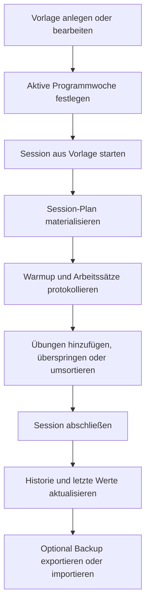

## 1. Produktübersicht
Gym Book ist eine offline-first PWA für das Protokollieren und Steuern von Krafttraining auf dem Handy. Die App fokussiert sich auf schnelle, einhändige Bedienung im Studio, lokale Datenspeicherung und installierbares Verhalten über GitHub Pages.

- Hauptzweck ist die Abbildung von Trainingsplänen, laufenden Einheiten, Verlaufsdaten und Testwerten in einer robusten lokalen App ohne Backend für v1.
- Der direkte Nutzen liegt in schneller Trainingsdurchführung, klarer Progression pro Kalenderwoche und verlustfreier Historie auch bei späteren Template-Änderungen.

## 2. Kernfunktionen

### 2.1 Feature-Module
1. **Heute / Start**: aktives Programm, aktuelle Kalenderwoche, schnelle Startaktion für Vorlagen.
2. **Vorlagen**: Verwaltung von Workout-Templates mit geordneter Übungsliste und Progressionsbezug.
3. **Session**: materialisierte Trainingsausführung mit Warmup, Arbeitssätzen, Timer und Last-Values.
4. **Historie**: Übungsverlauf, letzte Werte und einfache Graphen.
5. **Tests**: links/rechts Testwerte mit Asymmetrie.
6. **Einstellungen & Backup**: Medienverwaltung, lokaler Export/Import, aktive Programmwoche.

### 2.2 Seitendetails
| Seitenname | Modulname | Funktionsbeschreibung |
|-----------|-----------|-----------------------|
| Heute | Programmstatus | Zeigt aktives Programm, aktuelle Kalenderwoche und den zuletzt genutzten Trainingskontext |
| Heute | Schnellstart | Startet eine Session aus einer Vorlage mit einem Tap |
| Vorlagen | Vorlagenliste | Listet Einheiten wie A/B, zeigt Anzahl Übungen und erlaubt Erstellen/Bearbeiten |
| Vorlagen | Übungseditor | Bearbeitet Name, Tracking-Typ, unilateral, Warmup, Arbeitssätze, Tempo, Rest, Hinweise und Medien |
| Vorlagen | Reihenfolge | Ordnet Übungen per klarer Move-Aktion statt feiner Drag-Ziele für Mobile um |
| Session | Fokuskarte aktuelle Übung | Stellt die aktuelle Übung groß dar, inklusive Hinweistext, Medien und Sollwerten für die Woche |
| Session | Satzprotokoll | Erfasst Warmup und Arbeitssätze mit Gewicht/Wiederholungen oder Sekunden plus optionaler Last |
| Session | Links/Rechts-Erfassung | Führt bei unilateralen Übungen getrennte Werte pro Seite mit gleicher Satzanzahl |
| Session | Laufende Plananpassung | Erlaubt Übung hinzufügen, überspringen und umsortieren ohne das Template implizit zu verändern |
| Session | Letzte Werte | Zeigt die letzte abgeschlossene Ausführung derselben Übung inkl. Kontext |
| Session | Pausentimer | Startet Ein-Tap-Rest-Timer und stellt Wiederherstellung nach Reload/Background sicher |
| Historie | Übungsverlauf | Zeigt letzte Trainingsdaten einer Übung als Liste und einfachen Graph |
| Tests | Testeinträge | Erfasst links/rechts Werte und berechnet Asymmetrie in Prozent |
| Einstellungen | Backup | Exportiert und importiert versionierte lokale Daten inklusive Medien |
| Einstellungen | Medien | Verwaltet lokal hochgeladene Bilder/GIFs/WebP in IndexedDB |

## 3. Kernabläufe
Ein Nutzer pflegt zuerst Vorlagen und Übungen, inklusive Medien und Progressionsbezug. Beim Start einer Einheit wird aus der Vorlage eine konkrete Session-Ausführung materialisiert. Währen des Trainings kann diese Session angepasst werden, ohne das zugrunde liegende Template mitzuziehen. Nach Abschluss stehen die Daten sofort für Last-Values, Historie und Tests lokal zur Verfügung. Backup erfolgt manuell per Export/Import.

## 4. User-Interface-Design
### 4.1 Designstil
- Primärfarben: dunkle, kontrastreiche Basis mit satten Grün-/Lime-Akzenten für Status und bestätigte Aktionen
- Sekundärfarben: warme Grautöne, Amber für Timer/Warning, Rot nur für destruktive Aktionen
- Button-Stil: große, stark gerundete Touch-Flächen mit hohem Kontrast und klaren Aktiv-Zuständen
- Typografie: kompakte, sehr gut lesbare Sans-Serif mit klarer Hierarchie zwischen Fokusinhalten und Nebeninfos
- Layout-Stil: mobile-first, bottom-reachable Aktionen, Karten für Fokusmodule, Tabs oder Segment-Controls für Hauptbereiche
- Icon-Stil: reduzierte Line-Icons mit starken Filled-States bei aktiven Trainingsaktionen

### 4.2 Seitenüberblick
| Seitenname | Modulname | UI-Elemente |
|-----------|-----------|-------------|
| Heute | Schnellstart | große Startkarte, Wochenbadge, letzte Session, primare Bottom-Aktion |
| Vorlagen | Übungseditor | Formular in klaren Abschnitten, große Stepper, Medienvorschau, Reihenfolge-Buttons |
| Session | Fokuskarte aktuelle Übung | dominante Headline, große Satzkarten, Sticky Timer, starke visuelle Trennung zwischen Warmup und Work |
| Historie | Übungsverlauf | kombinierte Statistikchips, einfacher Linien- oder Balkengraph, letzte Sessions als Karte |
| Tests | Testeinträge | Links/Rechts-Karten, automatische Asymmetrieanzeige, Verlaufsliste |
| Einstellungen | Backup und Medien | sichere Import/Export-Aktionen, Speicherstatus, Medienliste mit Vorschau |

### 4.3 Responsivität
- Mobile-first als Standard, da die primäre Nutzung im Studio auf dem Handy erfolgt
- Tablet/Desktop nur adaptiv erweitert, ohne die mobile Interaktionslogik zu verlieren
- Touch-Optimierung mit großen Zielen, wenig Präzisionsinteraktion und klaren Safe-Areas für Daumenreichweite
