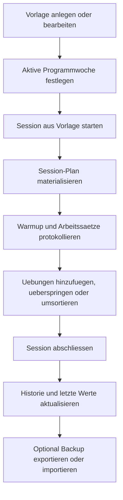

## 1. Produktuebersicht
Gym Book ist eine offline-first PWA fuer das Protokollieren und Steuern von Krafttraining auf dem Handy. Die App fokussiert sich auf schnelle, einhaendige Bedienung im Studio, lokale Datenspeicherung und installierbares Verhalten ueber GitHub Pages.

- Hauptzweck ist die Abbildung von Trainingsplaenen, laufenden Einheiten, Verlaufsdaten und Testwerten in einer robusten lokalen App ohne Backend fuer v1.
- Der direkte Nutzen liegt in schneller Trainingsdurchfuehrung, klarer Progression pro Kalenderwoche und verlustfreier Historie auch bei spaeteren Template-Aenderungen.

## 2. Kernfunktionen

### 2.1 Feature-Module
1. **Heute / Start**: aktives Programm, aktuelle Kalenderwoche, schnelle Startaktion fuer Vorlagen.
2. **Vorlagen**: Verwaltung von Workout-Templates mit geordneter Uebungsliste und Progressionsbezug.
3. **Session**: materialisierte Trainingsausfuehrung mit Warmup, Arbeitssaetzen, Timer und Last-Values.
4. **Historie**: Uebungsverlauf, letzte Werte und einfache Graphen.
5. **Tests**: links/rechts Testwerte mit Asymmetrie.
6. **Einstellungen & Backup**: Medienverwaltung, lokaler Export/Import, aktive Programmwoche.

### 2.2 Seitendetails
| Seitenname | Modulname | Funktionsbeschreibung |
|-----------|-----------|-----------------------|
| Heute | Programmstatus | Zeigt aktives Programm, aktuelle Kalenderwoche und den zuletzt genutzten Trainingskontext |
| Heute | Schnellstart | Startet eine Session aus einer Vorlage mit einem Tap |
| Vorlagen | Vorlagenliste | Listet Einheiten wie A/B, zeigt Anzahl Uebungen und erlaubt Erstellen/Bearbeiten |
| Vorlagen | Uebungseditor | Bearbeitet Name, Tracking-Typ, unilateral, Warmup, Arbeitssaetze, Tempo, Rest, Hinweise und Medien |
| Vorlagen | Reihenfolge | Ordnet Uebungen per klarer Move-Aktion statt feiner Drag-Ziele fuer Mobile um |
| Session | Fokuskarte aktuelle Uebung | Stellt die aktuelle Uebung gross dar, inklusive Hinweistext, Medien und Sollwerten fuer die Woche |
| Session | Satzprotokoll | Erfasst Warmup und Arbeitssaetze mit Gewicht/Wiederholungen oder Sekunden plus optionaler Last |
| Session | Links/Rechts-Erfassung | Fuehrt bei unilateralen Uebungen getrennte Werte pro Seite mit gleicher Satzanzahl |
| Session | Laufende Plananpassung | Erlaubt Uebung hinzufuegen, ueberspringen und umsortieren ohne das Template implizit zu veraendern |
| Session | Letzte Werte | Zeigt die letzte abgeschlossene Ausfuehrung derselben Uebung inkl. Kontext |
| Session | Pausentimer | Startet Ein-Tap-Rest-Timer und stellt Wiederherstellung nach Reload/Background sicher |
| Historie | Uebungsverlauf | Zeigt letzte Trainingsdaten einer Uebung als Liste und einfachen Graph |
| Tests | Testeintraege | Erfasst links/rechts Werte und berechnet Asymmetrie in Prozent |
| Einstellungen | Backup | Exportiert und importiert versionierte lokale Daten inklusive Medien |
| Einstellungen | Medien | Verwaltet lokal hochgeladene Bilder/GIFs/WebP in IndexedDB |

## 3. Kernablaeufe
Ein Nutzer pflegt zuerst Vorlagen und Uebungen, inklusive Medien und Progressionsbezug. Beim Start einer Einheit wird aus der Vorlage eine konkrete Session-Ausfuehrung materialisiert. Waehren des Trainings kann diese Session angepasst werden, ohne das zugrunde liegende Template mitzuziehen. Nach Abschluss stehen die Daten sofort fuer Last-Values, Historie und Tests lokal zur Verfuegung. Backup erfolgt manuell per Export/Import.

## 4. User-Interface-Design
### 4.1 Designstil
- Primaerfarben: dunkle, kontrastreiche Basis mit satten Gruen-/Lime-Akzenten fuer Status und bestaetigte Aktionen
- Sekundaerfarben: warme Grautoene, Amber fuer Timer/Warning, Rot nur fuer destruktive Aktionen
- Button-Stil: grosse, stark gerundete Touch-Flaechen mit hohem Kontrast und klaren Aktiv-Zustaenden
- Typografie: kompakte, sehr gut lesbare Sans-Serif mit klarer Hierarchie zwischen Fokusinhalten und Nebeninfos
- Layout-Stil: mobile-first, bottom-reachable Aktionen, Karten fuer Fokusmodule, Tabs oder Segment-Controls fuer Hauptbereiche
- Icon-Stil: reduzierte Line-Icons mit starken Filled-States bei aktiven Trainingsaktionen

### 4.2 Seitenueberblick
| Seitenname | Modulname | UI-Elemente |
|-----------|-----------|-------------|
| Heute | Schnellstart | grosse Startkarte, Wochenbadge, letzte Session, primare Bottom-Aktion |
| Vorlagen | Uebungseditor | Formular in klaren Abschnitten, grosse Stepper, Medienvorschau, Reihenfolge-Buttons |
| Session | Fokuskarte aktuelle Uebung | dominante Headline, grosse Satzkarten, Sticky Timer, starke visuelle Trennung zwischen Warmup und Work |
| Historie | Uebungsverlauf | kombinierte Statistikchips, einfacher Linien- oder Balkengraph, letzte Sessions als Karte |
| Tests | Testeintraege | Links/Rechts-Karten, automatische Asymmetrieanzeige, Verlaufsliste |
| Einstellungen | Backup und Medien | sichere Import/Export-Aktionen, Speicherstatus, Medienliste mit Vorschau |

### 4.3 Responsivitaet
- Mobile-first als Standard, da die primaere Nutzung im Studio auf dem Handy erfolgt
- Tablet/Desktop nur adaptiv erweitert, ohne die mobile Interaktionslogik zu verlieren
- Touch-Optimierung mit grossen Zielen, wenig Praezisionsinteraktion und klaren Safe-Areas fuer Daumenreichweite
