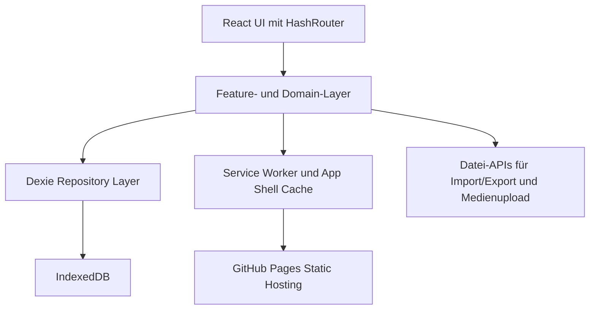
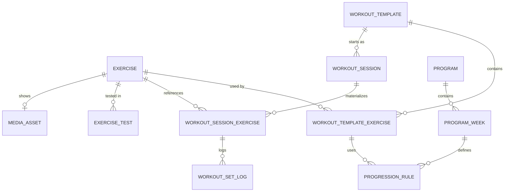

## 1. Architekturdesign



Die App ist eine rein statische Client-Anwendung auf GitHub Pages. Persistente Fachdaten liegen in IndexedDB und werden über Dexie adressiert. UI-State bleibt flüchtig und getrennt vom Persistenzmodell. Sessions werden beim Start aus Templates materialisiert, damit spätere Template-Änderungen historische Einheiten nicht rückwirkend verfälschen.

## 2. Technologiebeschreibung
- Frontend: React 18 + TypeScript + Vite
- Routing: `HashRouter` für robuste GitHub-Pages-Kompatibilität
- Styling: CSS-Variablen + modulare Styles oder co-located Styles; Fokus auf mobile-first Layout
- Persistenz: Dexie auf IndexedDB als Source of Truth
- PWA: `vite-plugin-pwa` mit App-Shell-Caching, Manifest, `start_url` und `scope` für `/gym-book/`
- Diagramme/Visualisierung: leichte, clientseitige Chart-Lösung für einfache Verlaufsgraphen
- Validierung: `zod` für Import/Export-Validierung und Laufzeitgrenzen an Systemschnittstellen
- Backend: keines in v1
- Deployment: GitHub Pages aus statischem Build

## 3. Routen-Definitionen
| Route | Zweck |
|-------|-------|
| `/#/` | Startansicht mit Programmstatus und Schnellstart |
| `/#/templates` | Vorlagenliste und Template-Verwaltung |
| `/#/templates/:templateId` | Bearbeitung einer Vorlage und ihrer Übungen |
| `/#/session/:sessionId` | Laufende oder wiederhergestellte Trainingssession |
| `/#/history` | Historie und Übungsverlauf |
| `/#/tests` | Testwerte für links/rechts und Asymmetrie |
| `/#/settings` | Einstellungen, Medienverwaltung, Export/Import |

## 4. API-Definitionen
Es gibt in v1 keine Remote-API. Interne Grenzen werden über TypeScript-Typen, Domain-Funktionen und Repository-Schnittstellen abgebildet.

```ts
export type TrackingMode = 'reps_weight' | 'time' | 'time_weight';
export type SetKind = 'warmup' | 'work';
export type Side = 'both' | 'left' | 'right';

export interface Exercise {
  id: string;
  name: string;
  instructions?: string;
  tempo?: string;
  trackingMode: TrackingMode;
  unilateral: boolean;
  mediaAssetId?: string;
  createdAt: string;
  updatedAt: string;
}

export interface WorkoutTemplate {
  id: string;
  name: string;
  notes?: string;
  createdAt: string;
  updatedAt: string;
}

export interface WorkoutTemplateExercise {
  id: string;
  templateId: string;
  exerciseId: string;
  orderIndex: number;
  workSetCount: number;
  targetReps?: number;
  targetSeconds?: number;
  targetWeight?: number;
  restSeconds?: number;
  progressionRuleId?: string;
  notes?: string;
}

export interface WorkoutSession {
  id: string;
  templateId: string;
  templateNameSnapshot: string;
  resolvedProgramWeek: number;
  startedAt: string;
  completedAt?: string;
  status: 'active' | 'completed' | 'aborted';
}

export interface WorkoutSessionExercise {
  id: string;
  sessionId: string;
  exerciseId: string;
  exerciseNameSnapshot: string;
  sourceTemplateExerciseId?: string;
  orderIndex: number;
  wasSkipped: boolean;
  addedInSession: boolean;
  workSetCount: number;
  targetReps?: number;
  targetSeconds?: number;
  targetWeight?: number;
  restSeconds?: number;
  notes?: string;
}

export interface WorkoutSetLog {
  id: string;
  sessionExerciseId: string;
  setKind: SetKind;
  side: Side;
  setNumber: number;
  reps?: number;
  seconds?: number;
  weight?: number;
  completed: boolean;
  completedAt?: string;
}

export interface ExerciseTest {
  id: string;
  exerciseId: string;
  recordedAt: string;
  leftValue: number;
  rightValue: number;
  asymmetryPercent: number;
  notes?: string;
}

export interface Program {
  id: string;
  name: string;
  activeWeek: number;
  createdAt: string;
  updatedAt: string;
}

export interface ProgramWeek {
  id: string;
  programId: string;
  weekNumber: number;
  label?: string;
}

export interface ProgressionRule {
  id: string;
  templateExerciseId: string;
  programWeekId: string;
  targetReps?: number;
  targetSeconds?: number;
  targetWeight?: number;
  notes?: string;
}

export interface MediaAsset {
  id: string;
  mimeType: string;
  fileName: string;
  byteSize: number;
  blobRefKey: string;
  createdAt: string;
}

export interface AppSettings {
  id: 'app-settings';
  activeProgramId?: string;
  weekOverride?: number;
  exportSchemaVersion: number;
  updatedAt: string;
}
```

## 5. Server-Architekturdiagramm
Kein Server in v1. Deployment liefert ausschließlich statische Assets.

## 6. Datenmodell
### 6.1 Datenmodell-Definition



### 6.2 Daten-Definition und Persistenzregeln
```sql
CREATE TABLE exercise (
  id TEXT PRIMARY KEY,
  name TEXT NOT NULL,
  instructions TEXT,
  tempo TEXT,
  tracking_mode TEXT NOT NULL,
  unilateral INTEGER NOT NULL,
  media_asset_id TEXT,
  created_at TEXT NOT NULL,
  updated_at TEXT NOT NULL
);

CREATE TABLE workout_template (
  id TEXT PRIMARY KEY,
  name TEXT NOT NULL,
  notes TEXT,
  created_at TEXT NOT NULL,
  updated_at TEXT NOT NULL
);

CREATE TABLE workout_template_exercise (
  id TEXT PRIMARY KEY,
  template_id TEXT NOT NULL,
  exercise_id TEXT NOT NULL,
  order_index INTEGER NOT NULL,
  work_set_count INTEGER NOT NULL,
  target_reps INTEGER,
  target_seconds INTEGER,
  target_weight REAL,
  rest_seconds INTEGER,
  progression_rule_id TEXT,
  notes TEXT
);

CREATE TABLE workout_session (
  id TEXT PRIMARY KEY,
  template_id TEXT NOT NULL,
  template_name_snapshot TEXT NOT NULL,
  resolved_program_week INTEGER NOT NULL,
  started_at TEXT NOT NULL,
  completed_at TEXT,
  status TEXT NOT NULL
);

CREATE TABLE workout_session_exercise (
  id TEXT PRIMARY KEY,
  session_id TEXT NOT NULL,
  exercise_id TEXT NOT NULL,
  exercise_name_snapshot TEXT NOT NULL,
  source_template_exercise_id TEXT,
  order_index INTEGER NOT NULL,
  was_skipped INTEGER NOT NULL,
  added_in_session INTEGER NOT NULL,
  work_set_count INTEGER NOT NULL,
  target_reps INTEGER,
  target_seconds INTEGER,
  target_weight REAL,
  rest_seconds INTEGER,
  notes TEXT
);

CREATE TABLE workout_set_log (
  id TEXT PRIMARY KEY,
  session_exercise_id TEXT NOT NULL,
  set_kind TEXT NOT NULL,
  side TEXT NOT NULL,
  set_number INTEGER NOT NULL,
  reps INTEGER,
  seconds INTEGER,
  weight REAL,
  completed INTEGER NOT NULL,
  completed_at TEXT
);

CREATE TABLE exercise_test (
  id TEXT PRIMARY KEY,
  exercise_id TEXT NOT NULL,
  recorded_at TEXT NOT NULL,
  left_value REAL NOT NULL,
  right_value REAL NOT NULL,
  asymmetry_percent REAL NOT NULL,
  notes TEXT
);
```

- In Dexie werden diese Tabellen als explizite Stores mit Indexen auf Fremdschlüssel und Zeitfeldern modelliert.
- Historische Korrektheit entsteht über Snapshots in `workout_session` und `workout_session_exercise`.
- Der Session-Start muss Progression für die aktive Kalenderwoche auflösen und in die Session übernehmen.
- Import/Export wird versioniert und mit Schema- sowie Referenzprüfung validiert.
- Medien bleiben lokal in IndexedDB; Export muss sie mitschicken, Import muss Typ und Größe prüfen.
