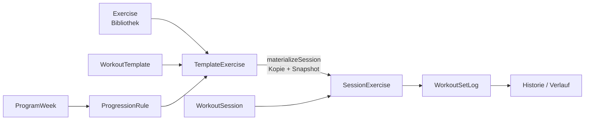
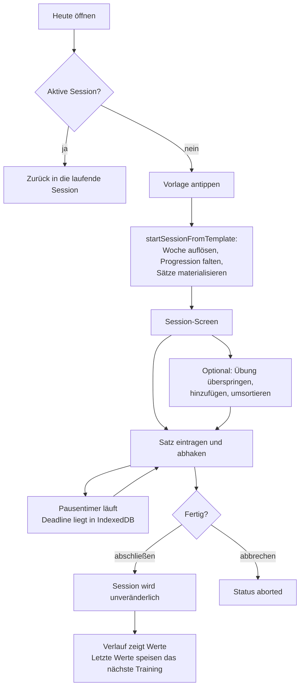
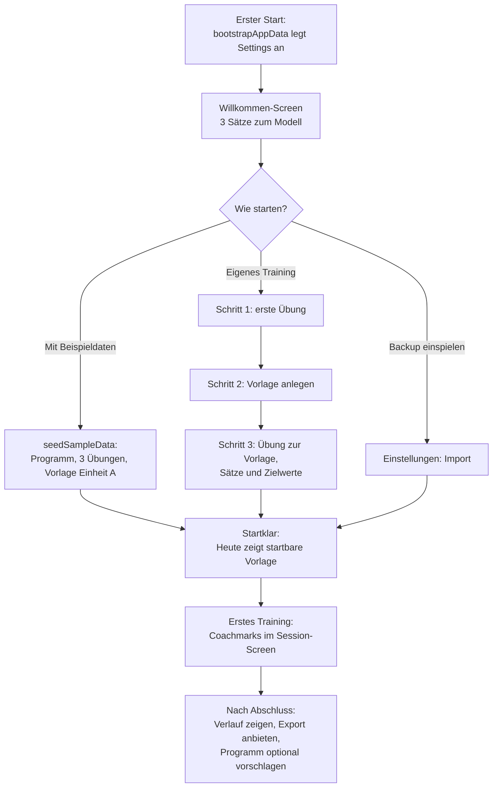

# Gym Book - App-Workflow und Onboarding

Zwei Teile: **A** beschreibt, wie die App heute funktioniert (Ist-Zustand, aus dem Code abgeleitet).
**B** beschreibt den Onboarding-Workflow für einen neuen Nutzer - Ist-Lücke, Soll-Ablauf, Texte,
Umsetzungsanker.

---

## Teil A - Wie die App funktioniert

### A.1 Mentales Modell

Vier Ebenen, strikt getrennt. Das ist die eine Sache, die ein Nutzer verstehen muss:

| Ebene | Objekt | Frage, die sie beantwortet |
| --- | --- | --- |
| Bibliothek | `Exercise` | *Was* trainiere ich? Stammdaten: Name, Tracking-Modus, unilateral, Tempo, Bild |
| Plan | `WorkoutTemplate` + `WorkoutTemplateExercise` | *Welche* Übungen in welcher Reihenfolge mit welchen Zielwerten? |
| Steuerung | `Program` + `ProgramWeek` + `ProgressionRule` | *Wie* verschieben sich die Zielwerte über die Wochen? |
| Ausführung | `WorkoutSession` + `WorkoutSessionExercise` + `WorkoutSetLog` | Was habe ich *tatsächlich* gemacht? |

Der zentrale Mechanismus: **Beim Start eines Trainings wird der Plan kopiert, nicht referenziert.**
`startSessionFromTemplate` materialisiert eine eigenständige Ausführungskopie samt Namens-Snapshots.
Wer danach die Vorlage ändert, ändert kein einziges vergangenes Training. Das ist der Grund, warum
die Historie dauerhaft korrekt bleibt - und warum ein Nutzer Vorlagen jederzeit anfassen darf.

### A.2 Screen-Landkarte

| Route | Screen | Zweck | Typischer nächster Schritt |
| --- | --- | --- | --- |
| `/` | Heute | Wochenanzeige, aktive Session, Vorlagen-Liste als Startknöpfe, letzter Abschluss | Vorlage antippen -> Session |
| `/programs` | Programme | Trainingsblock + Wochen anlegen, aktive Woche setzen | Vorlage mit Progression versehen |
| `/templates` | Vorlagen | Vorlage anlegen, Liste | Detail öffnen |
| `/templates/:id` | Vorlagen-Detail | Übungen zuordnen, Zielwerte, Reihenfolge (Drag), Wochenprogression | Zurück zu Heute, starten |
| `/exercises` | Übungen | Bibliothek pflegen: Name, Anleitung, Tempo, Tracking-Modus, unilateral, Bild | Vorlage befüllen |
| `/session/:id` | Session | Sätze loggen, Pausentimer, Übung überspringen/hinzufügen, abschließen | Abschließen -> Verlauf |
| `/history` | Verlauf | Abgeschlossene Einheiten pro Übung, Progressionsverlauf | Detail einer Session |
| `/tests` | Tests | Links/Rechts-Werte erfassen, Asymmetrie in Prozent | - |
| `/settings` | Einstellungen | Aktives Programm, Wochensteuerung, Beispieldaten, Export/Import, Reset | - |

Die Bottom-Nav trägt sechs Einträge; Einstellungen sitzt als Zahnrad im Header. Während einer
laufenden Session wird die Nav ausgeblendet - der Nutzer soll im Training bleiben.

### A.3 Der Trainings-Loop (Kern-Workflow)

Wichtige Regeln, die im Ablauf sichtbar werden:

- **Genau eine aktive Session.** Der Check sitzt in der Insert-Transaktion, zwei schnelle Taps
  erzeugen kein zweites Training. Auf Heute erscheint stattdessen der Hinweis, das laufende Training
  erst zu beenden.
- **Woche schlägt Vorlage.** Beim Start gilt `weekOverride ?? program.activeWeek ?? 1`; die passende
  `ProgressionRule` überschreibt die Zielwerte der Vorlage. Die aufgelöste Woche wird auf der
  Session eingefroren.
- **Ein Aufwärmsatz** pro Übung, danach die Arbeitssätze. Unilaterale Übungen erzeugen je
  Satznummer eine Zeile links und eine rechts.
- **Abgeschlossene Sessions sind unveränderlich.** Kein nachträgliches Editieren, kein Umsortieren.
- **Alles bleibt lokal.** IndexedDB, kein Backend, kein Sync. Die einzige Datensicherung ist der
  Export in den Einstellungen.

### A.4 Was der Nutzer nach dem Training bekommt

- **Verlauf**: pro Übung die abgeschlossenen Arbeitssätze mit Datum und Vorlagenname.
- **Letzte Werte** im Session-Screen: die Werte des letzten Mals stehen direkt über den Eingaben -
  das ersetzt das Nachschlagen in der Historie während des Trainings.
- **Tests**: Links/Rechts-Vergleich mit Asymmetrie in Prozent, unabhängig vom Trainingslog.

---

## Teil B - Onboarding

### B.1 Ist-Zustand und die Lücke

`bootstrapAppData` legt beim ersten Start **nur die Einstellungszeile** an. Das ist bewusst so:
früher wurde eine erfundene Trainingshistorie erzeugt, was "Letzte Werte" für nie ausgeführte
Übungen vorschlug.

Die Folge ist aber ein leerer Start:

- Heute zeigt "Keine aktive Session" und "Noch keine Vorlage" mit einem Link zu den Vorlagen.
- Die Vorlage lässt sich anlegen, ist aber leer - Übungen fehlen noch.
- Übungen anlegen, zurück ins Vorlagen-Detail, zuordnen, Zielwerte setzen.
- Programm und Wochenprogression sind ein eigener, nirgends angekündigter Zweig.
- Beispieldaten und Export liegen in den Einstellungen, die im Header versteckt sind.

Der Nutzer muss also die Abhängigkeitskette **Übung -> Vorlage -> (Programm) -> Session** selbst
erraten, in genau dieser Reihenfolge, verteilt über vier Screens. Das ist die Lücke, die das
Onboarding schließt.

### B.2 Leitplanken

1. **Kein Wegwerf-Tutorial.** Jeder Onboarding-Schritt erzeugt echte Daten, die der Nutzer behält.
2. **Überspringbar und wiederaufnehmbar.** Abbruch darf nie in einen kaputten Zustand führen; der
   Fortschritt ergibt sich aus dem Datenbestand, nicht aus einem Zähler.
3. **Zwei Pfade.** "Ausprobieren" (Beispieldaten) und "Eigenes Training" - beide enden im gleichen
   Zustand: mindestens eine startbare Vorlage.
4. **Programm ist optional.** Ohne Programm läuft alles in Woche 1. Progression ist Kür, nicht
   Pflicht, und gehört nicht in den ersten Durchlauf.
5. **Datensicherheit einmal erwähnen, nicht dauernd.** Lokal-only + Export gehört an den
   Abschluss, nicht an den Anfang.

### B.3 Soll-Ablauf

#### Schritt 0 - Willkommen (Vollbild, einmalig)

Erscheint, solange `settings.onboardingCompletedAt` leer ist **und** die Datenbank leer ist
(`exercises.count() === 0 && workoutTemplates.count() === 0`). Inhalt: drei Sätze zum Modell
(Bibliothek -> Vorlage -> Training -> Verlauf), Hinweis "läuft komplett offline auf diesem Gerät",
und die drei Auswahlkacheln. "Überspringen" führt direkt auf Heute mit sichtbarer Checkliste.

#### Pfad A - Beispieldaten

Ein Tap auf `seedSampleData()`: Programm "Unterkörper Aufbau" mit acht Wochen, drei Übungen
(darunter eine unilaterale und eine Zeit-basierte), Vorlage "Einheit A" mit Wochenprogression, eine
abgeschlossene Beispiel-Session und ein Asymmetrie-Test. Danach direkt auf Heute mit dem Hinweis,
dass sich alles über Einstellungen -> Zurücksetzen wieder entfernen lässt.

Wichtig: `seedSampleData` wirft, wenn die Bibliothek nicht leer ist. Die Kachel darf im Onboarding
also nur bei leerer Datenbank angeboten werden.

#### Pfad B - Eigenes Training, drei geführte Schritte

| Schritt | Screen | Minimal-Eingabe | Ergebnis |
| --- | --- | --- | --- |
| 1 | Übung anlegen | Name, Tracking-Modus, unilateral ja/nein | erste `Exercise` |
| 2 | Vorlage anlegen | Name | erste `WorkoutTemplate` |
| 3 | Übung zur Vorlage | Übung wählen, Arbeitssätze, Zielwerte | erste `WorkoutTemplateExercise` |

Jeder Schritt zeigt Fortschritt ("Schritt 2 von 3") und einen Satz, der erklärt **warum** es diesen
Schritt gibt - beim Tracking-Modus etwa: "Bestimmt, ob du Wiederholungen oder Sekunden einträgst;
unilateral erzeugt getrennte Zeilen für links und rechts."

Nach Schritt 3 gilt der Nutzer als startklar. Kein weiterer Zwang.

#### Erstes Training - Coachmarks statt Text

Beim ersten Öffnen von `/session/:id` (Bedingung: es gibt genau eine Session und ihr Status ist
`active`) drei kurze Hinweise, jeweils einzeln wegtippbar:

1. Der Aufwärmsatz steht oben und zählt nicht in die Arbeitssätze.
2. Ein Tap auf den Haken schließt den Satz ab und startet den Pausentimer.
3. Abschließen macht die Session unveränderlich - Abbrechen verwirft sie nicht, sondern markiert
   sie als abgebrochen.

#### Nach dem ersten Abschluss

Auf Heute eine einmalige Karte: Verlauf verlinken, Export als Backup anbieten ("deine Daten liegen
nur auf diesem Gerät"), und - erst jetzt - Programm plus Wochenprogression als nächsten Schritt
vorschlagen. Danach `onboardingCompletedAt` setzen, Karte verschwindet.

### B.4 Checkliste auf Heute (der Faden, wenn jemand überspringt)

Solange nicht startklar, steht oben auf Heute eine Karte "Einrichtung" mit abgeleitetem Zustand -
nicht mit gespeichertem Fortschritt:

| Punkt | Erfüllt, wenn | Aktion |
| --- | --- | --- |
| Übung angelegt | `exercises.count() > 0` | -> `/exercises` |
| Vorlage angelegt | `workoutTemplates.count() > 0` | -> `/templates` |
| Vorlage befüllt | mind. eine Vorlage mit >= 1 Übung | -> `/templates/:id` |
| Optional: Programm | `settings.activeProgramId` gesetzt | -> `/programs` |

Der Vorteil des abgeleiteten Zustands: wer sein Setup später löscht oder ein Backup einspielt,
bekommt automatisch den passenden Faden - ohne Migrationslogik für einen Fortschrittszähler.

### B.5 Textvorschläge (Deutsch, ASCII wie im Rest der App)

- Willkommen: **"Dein Trainingslog - offline, auf diesem Gerät."**
  "Du legst Übungen an, baust daraus Vorlagen und startest daraus Trainings. Jedes Training wird als
  eigene Kopie gespeichert - spätere Änderungen an der Vorlage verbiegen deine Historie nicht."
- Kachel A: **"Mit Beispieldaten starten"** - "Ein fertiges Programm zum Durchklicken. Jederzeit
  löschbar."
- Kachel B: **"Eigenes Training aufbauen"** - "Drei Schritte bis zum ersten Start."
- Kachel C: **"Backup einspielen"** - "Du hast schon eine Export-Datei aus Gym Book."
- Schritt 1: **"Womit trainierst du?"** - "Erst die Übung, dann die Vorlage. Übungen sind
  Stammdaten und lassen sich in beliebig vielen Vorlagen verwenden."
- Schritt 2: **"Wie heißt deine Einheit?"** - "Zum Beispiel Push, Unterkörper oder Einheit A."
- Schritt 3: **"Wie viele Sätze und welches Ziel?"** - "Ein Aufwärmsatz kommt automatisch dazu."
- Abschluss: **"Startklar."** - "Auf Heute tippst du deine Vorlage an und das Training läuft."

### B.6 Umsetzungsanker

- **Zustandsfeld**: `onboardingCompletedAt?: string` auf `AppSettings`
  ([models.ts:137](../src/domain/models.ts#L137)). Nicht indiziert, also **keine** neue
  `version(3)`-Migration nötig - Dexie speichert das ganze Objekt. Aber: `appSettingsSchema` in
  [export.ts:160](../src/lib/export.ts#L160) ergänzen. Ein optionales Feld ist abwärtskompatibel,
  ein Bump von `SNAPSHOT_SCHEMA_VERSION` ist dafür nicht zwingend.
- **Einstiegspunkt**: Gate in [App.tsx](../src/App.tsx) nach `bootstrapAppData`, oder eine Route
  `/onboarding` mit Redirect aus `/`. Route ist sauberer - `HashRouter` bleibt, Deep-Links bleiben.
- **Schreibwege**: ausschließlich über die bestehenden Actions
  (`createExercise`, `createTemplate`, `addTemplateExercise`, `setActiveProgram`, `seedSampleData`) -
  das Onboarding bekommt keinen eigenen Dexie-Zugriff.
- **Checkliste**: eigene Komponente, liest per `useLiveQuery` die vier Counts. Kein Zustand im
  Zustand-Store - der ist ephemer und überlebt keinen Reload.
- **Coachmarks**: die "einmal gesehen"-Flags sind reine UI-Ephemera und gehören nach
  `localStorage`, nicht in IndexedDB - sie sind kein Domänenwissen und müssen nicht exportiert
  werden.
- **Tests**: Unit für die Ableitung "startklar ja/nein" (pure Funktion in `src/domain/`), E2E in
  `e2e/` für den Durchlauf auf WebKit - der leere Erststart ist genau der Zustand, den die
  vorhandenen Specs nicht abdecken.

### B.7 Akzeptanzkriterien

1. Erster Start auf einem leeren Gerät endet nach höchstens drei Eingaben in einer startbaren
   Vorlage.
2. Abbruch an jeder Stelle hinterlässt eine konsistente Datenbank; die Checkliste auf Heute zeigt
   exakt den offenen Rest.
3. Beispieldaten-Pfad ist vollständig reversibel über Einstellungen -> Zurücksetzen.
4. Kein Onboarding-Schritt erzeugt Trainingshistorie, die der Nutzer nicht selbst absolviert hat -
   außer im ausdrücklich gewählten Beispieldaten-Pfad.
5. Nach Import eines Backups wird kein Onboarding mehr gezeigt.
6. Alle Schritte erfüllen die bestehenden UI-Regeln: 44px Touch-Targets, sichtbarer Fokusring,
   4.5:1 Kontrast, einhändig bedienbar.
